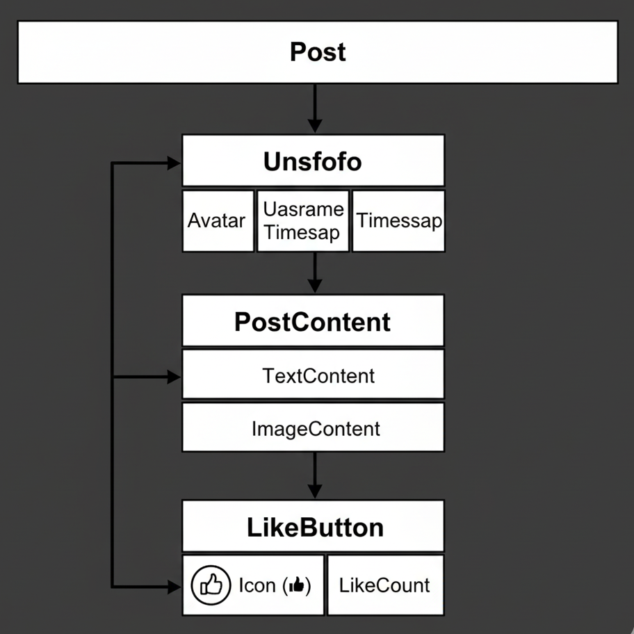

# REACT JS

## Definition

React is an open-source JavaScript library for building user interfaces, especially single-page applications (SPAs).

Core Idea : Build UI as components, React manages updates efficiently.

## Two Core Promises

### (a) Composable Components

- UI is not one big file; it’s small, reusable pieces.
- Social media post → Avatar, UserInfo, PostContent, LikeButton.
- LEGO blocks → build bigger structures from small pieces.
- Benefits: Reusability, maintainability, separation of concerns.

### (b) Efficient UI Updates

- Instead of refreshing whole page, React updates only the changed part.
- Editing a Word doc → only replace one word, not the full paragraph.
- Key Concept: Virtual DOM.

## Core Concepts of React

### (a) Component Model (UI = Tree of Components)

Post → Avatar + UserInfo + PostContent + LikeButton



```
Post
│
│
├── UserInfo
│   ├── UserName
│   ├── TimeStamp
│   └── Avatar
│
├── PostContent
│   ├── TextContent
│   └── ImageContent
│
└── LikeButton
    ├── Icon (👍)
    └── LikeCount

```

### (b) Declarative UI

- You declare what the UI looks like, React figures out how.

- Imperative :
  - JS: `document.createElement("li")`
- Declarative :
  - React: `<h1>{isLoggedIn ? "Welcome" : "Please log in"}</h1>`

## Why React is More Than Just UI

### (a) Ecosystem

- React is the view layer only.
- Extra features come from libraries:
  - Routing → react-router
  - State → Redux/Zustand
  - Styling → CSS/Tailwind/styled-components
- Analogy: Smartphone + install apps.

### (b) Cross-Platform

- react-dom → Web
- react-native → Mobile
- Same Button logic works for both.

## Why It Matters (The "Why")

- Faster Development → Reuse components.
- Reusability → Across apps & teams.
- Huge Community → Easy learning, lots of jobs.
- Cross-Platform Reach → Build once, run everywhere.

### Note => But React is often used for Single-Page Applications (SPAs)

## SPA vs MPA

### MPA (Multi-Page Application)

- Each URL = new HTML file from the server.
- Every navigation → full page reload.
- Examples: Old Gmail, Wikipedia, Amazon.

### SPA (Single-Page Application)

- Only one `index.html` is loaded.
- Navigation is handled by JavaScript (React, Angular, Vue, etc.).
- Examples: Modern Gmail, Facebook.

### Navigation Differences

#### MPA Flow:

    - User clicks link → HTTP request → new HTML → page reload.
    - Clicking a link reloads the page (show flicker / network request in browser dev tools).

#### SPA Flow:

    - User clicks link → React intercepts → updates only part of page → no reload.
    - No network request for HTML page

### SEO & Initial Load

- **MPA** :

  - Good SEO → each page has HTML content.
  - Blog App → better as MPA (SEO is critical).

- **SPA** :
  - SEO challenges → empty HTML at first, JS fills later.
  - Dashboard App → better as SPA (SEO not important).

### Responsiveness & User Experience

- **SPA** : Faster, smoother, feels like a mobile app.
- **MPA** : Slower, flickers due to reloads.

### Complexity & Use Cases

- **SPA** : Needs client-side routing, state management.
- **MPA** : Simpler → server handles everything.

- When to Use:

  - **SPA** → social media, dashboards, Gmail.
  - **MPA** → blogs, news sites, marketing websites.

### Summary :

| Feature        | MPA                  | SPA                          |
| -------------- | -------------------- | ---------------------------- |
| Pages          | Multiple HTML files  | Single HTML file             |
| Navigation     | Full reload          | Client-side routing          |
| Responsiveness | Slower, flickers     | Smooth, app-like             |
| SEO            | Strong               | Needs SSR/prerendering       |
| Complexity     | Simpler              | More complex                 |
| Best for       | Blogs, content-heavy | Dashboards, interactive apps |

#### Note => But SPAs rely on JavaScript updating the DOM instead of server-rendered pages. Direct DOM manipulation is expensive. How does React make SPAs fast?

## Virtual DOM

### DOM (Document Object Model)

- The DOM = browser’s tree structure of your HTML.
- Every `<div>, <p>, <ul>` = node in a tree.
- Why it matters:
  - Updating the real DOM triggers repaints/reflows (slow for large apps).

### Introduce the Virtual DOM

- A lightweight, in-memory copy of the DOM (just JS objects).

- **How it works**:
  - First render → React builds a VDOM → converts it into real DOM.
  - When state changes → React builds a new VDOM.
  - React compares new vs old VDOM (diffing).
  - React updates only changed parts in the real DOM (batching).
- **Benefit**:

  - Fewer expensive DOM updates → faster, smoother UI.

- Example => text editor’s spell-check. Instead of rewriting the whole doc, it only fixes mistakes.

### Sequence

- **Initial render**: VDOM → Real DOM.
- **State change**: React creates a new VDOM.
- **Diffing (reconciliation)**: Compare new vs old VDOM.
- **Update**: Only affected nodes updated in the real DOM.
- Browser repaints once, not for every change.

=> React optimizes updates with Virtual DOM + diffing → efficient rendering.
But how does React know what to update in the first place?
That depends on how data flows in React (state & props)

## One-Way Data Binding

- In React, data always flows down from parent → child.
- Children can’t change data directly — they must ask the parent to update it.
- This is important because React decides what to re-render by comparing old vs new Virtual DOM, which comes from the state/props tree.
- **Why This Matters Together** -

  - **Without one-way binding** →
    any component could change any other’s state → unpredictable Virtual DOM → hard to optimize.

  - **With one-way binding** →
    React always knows the source of truth → makes VDOM diffing predictable & efficient.

## How do we actually start building React apps with these features?”

### Why We Need a Build Tool

- Writing React means using JSX (HTML + JS mixed).
- Browsers don’t understand JSX directly.
- We need a tool to:
  - Convert JSX → plain JavaScript.
  - Bundle everything together.
  - Provide fast refresh (see changes instantly).
- That’s where Vite comes in.

### What is Vite?

- Vite = modern React project setup tool.
- Key benefits:
  - Super fast dev server (uses ES Modules under the hood).
  - Hot Module Replacement (HMR) → only reloads changed files, not whole app.
  - Easy bundling for production.
